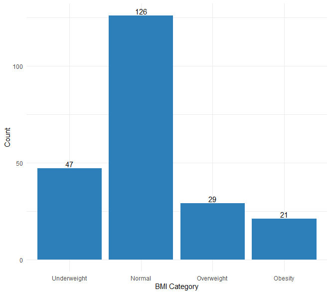
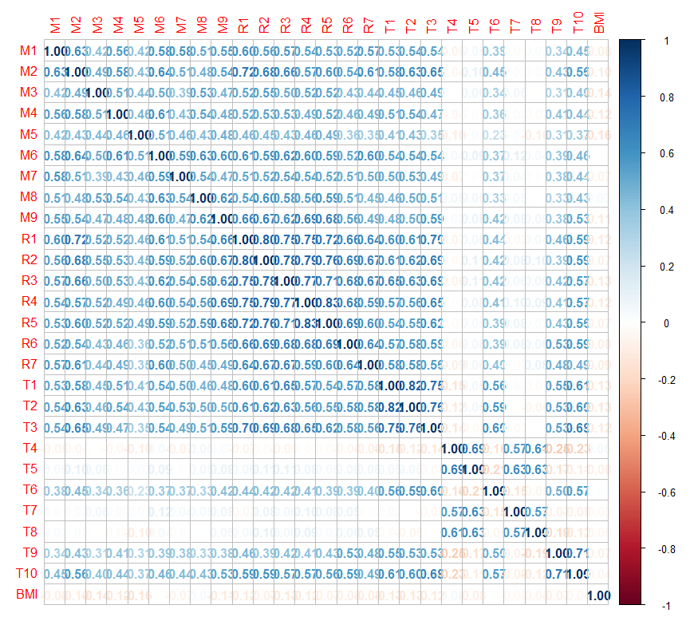
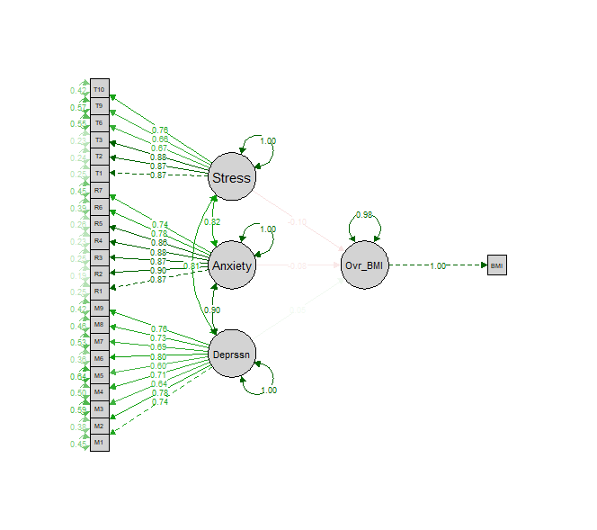
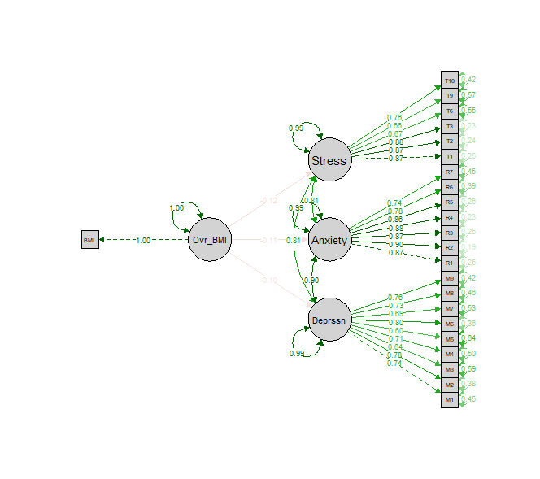

# The Relationship between Psychological Aspects and BMI among Undergraduate Students of Faculty of Science and Technology, UKM

## 📖 Project Overview

This project investigates the bidirectional relationship between psychological aspects and Body Mass Index (BMI) among undergraduate students at the Faculty of Science and Technology (FST), Universiti Kebangsaan Malaysia (UKM).

Using Structural Equation Modeling (SEM), the study examines how depression, anxiety, and stress relate to BMI, and whether BMI in turn influences these psychological factors. The project aims to contribute to a better understanding of the interaction between mental health and physical health in university students.

## 🎯 Objectives

The main objectives of this project are:

- To perform exploratory data analysis (EDA) to understand patterns and characteristics of the data.
- To analyze the bidirectional relationship between psychological aspects (depression, anxiety, stress) and BMI.
- To examine the relationships among psychological variables using Structural Equation Modeling (SEM).

## 🎓 Significance of the Study

- Provides insight into mental and physical health integration among university students.
- Supports evidence-based university health policy planning.
- Contributes to academic literature on bidirectional SEM modeling in health studies.
- Aligns with SDG 3.4: Reducing premature mortality from non-communicable diseases and promoting mental health

## 🧠 Psychological Constructs Studied

- Depression
- Anxiety
- Stress

These constructs are measured using validated questionnaire items and modeled as latent variables in SEM.

## 🛠 Tools & Technologies

- Statistical Software: R
- Packages: lavaan, psych, semTools, ggplot2, semPlot, corrplot, parameters, mvnormalTest, dplyr

## 🧪 Methodology

**1. Data Collection**

- Primary data collected via online questionnaire (Google Forms)
- Target population: Undergraduate students of FST, UKM (2024/2025)
- Distribution through social media and QR codes
- Data collected:
  - Self-reported height and weight (for BMI calculation)
  - Demographic information
  - Psychological measures:
    - Depression (measured using Patient Health Questionnaire-9 – PHQ-9)
    - Anxiety (measured using General Anxiety Disorder-7 – GAD-7)
    - Stress (measured using Perceived Stress Scale-10 – PSS-10)
- Sampling method: Non-probability convenience sampling

**2. Data Analysis**

- Exploratory Data Analysis (EDA)
  - Descriptive statistics and data visualization
  - Normality test
  - Preliminary tests for factor analysis
- Confirmatory Factor Analysis (CFA)
  - Validation of depression, anxiety, and stress constructs
  - Assessment of reliability and construct validity
- Structural Equation Modeling (SEM)
  - Analysis of bidirectional relationships between psychological aspects and BMI
  - Examination of relationships among psychological constructs
- Estimation Method
  - Maximum Likelihood Robust (MLR) used for CFA and SEM to account for non-normality

**3. Model Fit Evaluation**

- Model adequacy assessed using:
  - Absolute fit indices (χ²/df, RMSEA, SRMR)
  - Incremental fit indices (CFI, TLI)
  - Parsimony fit indices (PGFI)

## 📊 Key Findings

- Psychological aspects (depression, anxiety, stress) do not significantly influence BMI.
- BMI has a significant but weak and inverse effect on psychological aspects.
- Strong positive relationships exist among depression, anxiety, and stress.
- An increase in BMI is associated with a slight decrease in psychological distress levels.

These findings highlight the complex and non-linear nature of mental–physical health interactions among students.

## 🖼️ Visualizations

### Distribution of BMI Categories

### Correlation Matrix Heatmap

### SEM Model 1

### SEM Model 2

## 📊 Model Fit Evaluation

### SEM Model 1

| Fit Index | Good fit value |   Acceptable value   | Value | Evaluation |
|-----------|----------------|----------------------|-------|------------|
| χ²/df     |      ≤ 2       |    2 < χ²/df ≤ 5     | 2.107 | Acceptable |
| RMSEA     |     ≤ 0.08     |  0.08 < RMSEA ≤ 0.10 | 0.070 |  Good fit  |
| SRMR      |     ≤ 0.50     |  0.05 < SRMR ≤ 0.08  | 0.043 |  Good fit  |
| CFI       |     ≥ 0.95     |   0.90 ≤ CFI < 0.95  | 0.935 |  Good fit  |
| TLI       |     ≥ 0.95     |   0.90 ≤ TLI < 0.95  | 0.927 | Acceptable |
| PGFI      |        -       |        ≥ 0.50        | 0.683 | Acceptable |

### SEM Model 2

